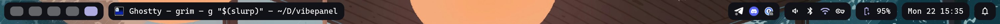
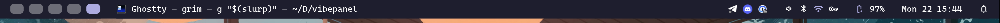
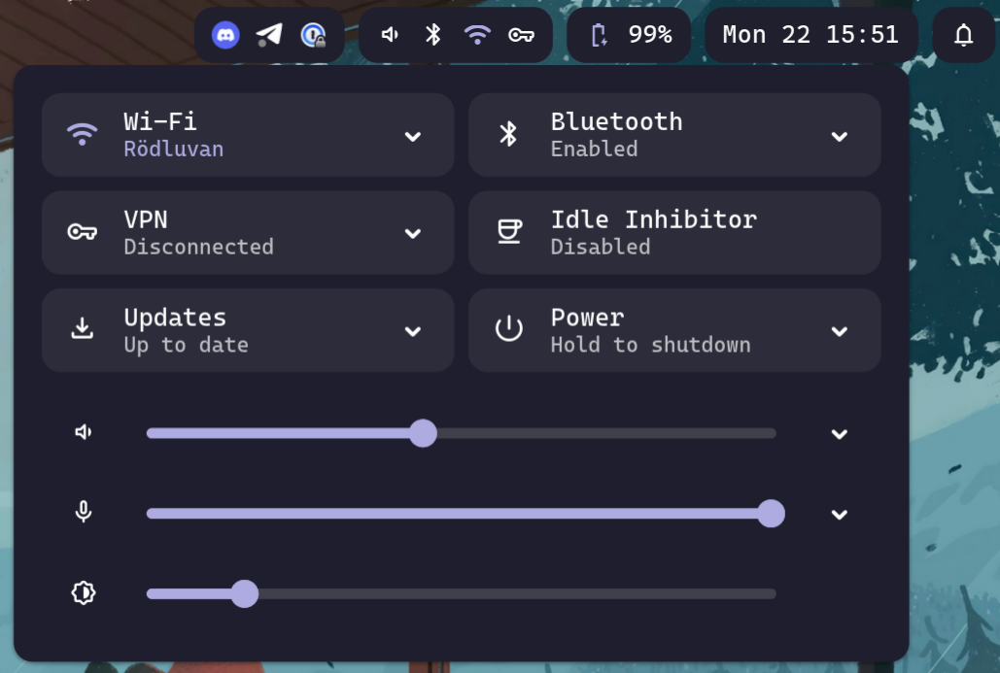

# VibePanel



A GTK4 status bar for Wayland. Supports Hyprland, Niri and MangoWC/DWL.

VibePanel aims to be a simple bar that just works and looks good without configuration while also being fully customizable. Configure what you need, ignore what you don't.

## Features

- **Hot-reload** - config and style changes apply instantly
- **Multi-monitor support** - Configure which monitors to display the bar on
- **Theming** - dark/light modes, custom accents, GTK theme integration, full CSS customization
- **OSD** - on-screen display for brightness and volume changes
- **CLI tools** - control brightness, volume, and idle inhibition
- **Widgets**
  - Workspaces - clickable indicators with tooltips
  - Window title - active window with app icon
  - Clock - configurable format with calendar popover
  - Battery - status with detailed popover and power profiles
  - Quick settings - audio, brightness, bluetooth, wifi, VPN, power profiles, idle inhibitor
  - System tray - XDG tray support
  - Notifications - notification center with Do Not Disturb
  - Updates - package update indicator (dnf and pacman/paru support right now)
  - CPU & Memory - system resource monitors

## Screenshots



<p>
  
  
  
</p>

## Status

VibePanel is in early 0.x development but should be stable enough for daily use.
Config options and defaults may change between minor releases, check the changelog when upgrading.

### Compatibility

- **Compositors:** Hyprland, Niri, MangoWC/DWL. Sway support may be added based on demand.
- **Updates widget:** dnf and pacman/paru. More package managers planned.

## Quickstart

1. Install runtime dependencies: Wayland, a supported compositor (Hyprland, Niri, MangoWC, DWL), PulseAudio/PipeWire, UPower, NetworkManager, BlueZ, GTK4.

2. Install VibePanel:

   - **Option A: Download a release binary** (recommended)

     Download the latest `vibepanel-<target>` from the GitHub Releases page and place it in your `$PATH`, e.g.:

     ```sh
     install -Dm755 vibepanel-x86_64-unknown-linux-gnu ~/.local/bin/vibepanel
     ```

   - **Option B: Build from source**

     ```sh
     git clone https://github.com/prankstr/vibepanel.git
     cd vibepanel
     cargo build --release
     install -Dm755 target/release/vibepanel ~/.local/bin/vibepanel
     ```

3. Create a config and run:

   ```sh
   mkdir -p ~/.config/vibepanel
   vibepanel --print-default-config > ~/.config/vibepanel/config.toml
   vibepanel &
   ```

## Configuration

Config lives at `~/.config/vibepanel/config.toml`. Here's a minimal example:

```toml
[widgets]
left = ["workspace", "window_title"]
right = ["quick_settings", "battery", "clock"]

[theme]
mode = "dark"
accent = "#adabe0"
```

See [docs/configuration.md](docs/configuration.md) for all options and [docs/css-variables.md](docs/css-variables.md) for styling.

## Vibe Code Disclaimer

As the title suggests, this project is mainly vibe coded. I'm not a Rust developer and had little GTK experience when starting this project. I've done my best to keep the codebase solid and maintainable, but rough edges might exist. You have been warned :)

## Documentation

Configuration, theming, CLI usage, and compositor notes will be documented in the GitHub wiki.

For a raw reference of all config options and CSS variables, you can also check the files in `docs/` inside this repository.

## Contributing

Contributions are welcome! Feel free to open issues or submit pull requests.

## License

MIT
